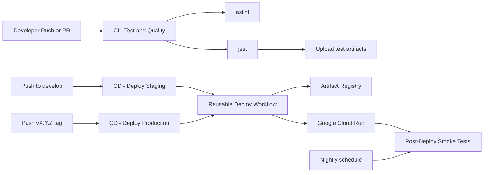

# Void Flow WOW+

[](https://github.com/TheOmegaFett/void/actions/workflows/ci.yml)
[](https://github.com/TheOmegaFett/void/actions/workflows/deploy_staging.yml)
[](https://github.com/TheOmegaFett/void/actions/workflows/deploy_prod.yml)
[](https://github.com/TheOmegaFett/void/actions/workflows/post_deploy_smoke.yml)


Node.js + Express app serving static content, with CI, staged deployments to Google Cloud Run, and post-deploy smoke checks.

- Repository: https://github.com/TheOmegaFett/void
- Production URL: https://void-flow-prod-496494976110.australia-southeast1.run.app/

## Overview

This repository includes:

- A lightweight Express server (`src/server.js`, `src/index.js`)
- Static frontend served from `public/index.html`
- CI workflow for linting and tests with uploaded artifacts
- Reusable Cloud Run deployment workflow for staging and production
- Smoke tests that run after deployment and on a schedule

## Website User Guide

If you want to use the app (not develop it), start here:

- Production app: https://void-flow-prod-496494976110.australia-southeast1.run.app/
- User instructions: `docs/tutorials/using-the-website.md`

Quick tips:

- Use preset buttons and sliders to explore visuals.
- Use `Record` / `Stop` to capture output.
- Check service health at `/health`.

## Developer Guide

If you are contributing code or operating deploys:

- Developer instructions: `docs/tutorials/developer-guide.md`
- Main workflows: `.github/workflows/ci.yml`, `.github/workflows/deploy_reusable.yml`

## Tool Choice

- Source control and collaboration: Git + GitHub, chosen for branch/tag-based release flow and native pull request checks.
- CI/CD orchestration: GitHub Actions, chosen because pipeline definitions live in-repo and are easy to version/review.
- Runtime platform: Google Cloud Run, chosen for managed autoscaling and low operational overhead for stateless HTTP service.
- Container image storage: Google Artifact Registry, chosen for tight IAM integration and regional proximity to deploy target.
- Cloud authentication: GitHub OIDC federation to GCP, chosen to avoid long-lived JSON keys and reduce credential risk.
- Application stack: Node.js + Express, chosen for a small, fast API/static-serving footprint with simple testability.

## Alternatives Comparison

### HD Comparison Summary (Why These Choices Here)

- GitHub Actions vs Jenkins/GitLab CI: this project uses GitHub Actions because workflows are repo-native, versioned with code, and fast to maintain; Jenkins/GitLab CI are valid alternatives but add more platform/admin overhead for this scope.
- Cloud Run vs Compute Engine vs GKE: this project uses Cloud Run because the service is stateless HTTP and benefits from managed autoscaling with minimal ops; Compute Engine is better for VM-level control and GKE for larger multi-service Kubernetes platforms.
- Artifact Registry vs Docker Hub: this project uses Artifact Registry because deployment, IAM, and regional hosting are all in GCP; Docker Hub is useful for broad/public distribution but is not as tightly integrated with GCP permissions.
- OIDC federation vs JSON key files: this project uses OIDC because credentials are short-lived and do not require storing long-lived private keys; JSON key files are easier initially but increase secret handling and leakage risk.

## Evidence Examples

- Example CI artifact: `test-artifacts/junit.xml` and `test-artifacts/test-output.log`
- Example deploy revision: `void-flow-prod-00001-...` in Cloud Run
- Example smoke test: `curl /health` and artifact `smoke-artifacts/*`

## HD Evidence Checklist (Screenshots)

- CI run passing (`CI - Test & Quality`) and the Artifacts tab showing `test-artifacts/*`
- Cloud Run revisions list showing new revision(s) after deploy
- Staging deploy run passing (`CD - Deploy Staging`)
- Production deploy run passing (`CD - Deploy Production`)
- Smoke test run passing (`Post-Deploy Smoke Tests`) and artifact `smoke-artifacts/*`

## Architecture



## Project Structure

```text
.
|-- .github/workflows/
|   |-- ci.yml
|   |-- deploy_reusable.yml
|   |-- deploy_staging.yml
|   |-- deploy_prod.yml
|   `-- post_deploy_smoke.yml
|-- public/
|   `-- index.html
|-- src/
|   |-- server.js
|   `-- index.js
|-- tests/
|   `-- health.test.js
|-- Dockerfile
`-- package.json
```

## Prerequisites

- Node.js 20.x
- npm 10+
- Docker (optional, for local container testing)
- Git

## Local Installation

1. Clone and enter the repo:

```bash
git clone https://github.com/TheOmegaFett/void.git
cd void
```

2. Install dependencies:

```bash
npm ci
```

3. (Optional) create local env file:

```bash
cp .env.example .env
```

## Run Locally

```bash
npm start
```

Server starts on `PORT` (default `8080`).

Open:

- http://localhost:8080/
- http://localhost:8080/health

## Testing and Quality

Run lint:

```bash
npm run lint
```

Run tests:

```bash
npm test
```

Run tests with JUnit output (same mode used in CI):

```bash
npm run test:junit
```

## Generate Documentation from Docstrings

Source docstrings are written in `src/server.js` and `src/index.js` using JSDoc.

Generate docs automatically:

```bash
npm run docs:generate
```

Output:

- Generated API docs site: `docs/api/index.html`
- Included tutorials:
  - `docs/tutorials/using-the-website.md`
  - `docs/tutorials/developer-guide.md`

## Docker (Local)

Build:

```bash
docker build -t void-flow-wowplus:local .
```

Run:

```bash
docker run --rm -p 8080:8080 void-flow-wowplus:local
```

Health check:

```bash
curl -sS http://localhost:8080/health
```

## API Endpoints and Examples

### `GET /health`

Returns JSON health response:

```json
{"ok": true, "env": "production"}
```

Local example:

```bash
curl -sS http://localhost:8080/health
```

Production example:

```bash
curl -sS https://void-flow-prod-496494976110.australia-southeast1.run.app/health
```

### `GET /`

Serves the static HTML app from `public/index.html`.

```bash
curl -I https://void-flow-prod-496494976110.australia-southeast1.run.app/
```

## Workflows

- `CI - Test & Quality` (`.github/workflows/ci.yml`) -> Trigger: pull requests and pushes to `main`/`develop` -> What it does: install, lint, run tests with JUnit -> What it outputs: `test-artifacts/junit.xml` and `test-artifacts/test-output.log`
- `CD - Deploy Staging` (`.github/workflows/deploy_staging.yml`) -> Trigger: push to `develop` -> What it does: build image, push to Artifact Registry, deploy Cloud Run staging via reusable workflow -> What it outputs: deployed staging service at `STAGING_URL` and a new Cloud Run revision (for example `void-flow-staging-0000x-...`)
- `CD - Deploy Production` (`.github/workflows/deploy_prod.yml`) -> Trigger: pushed tag matching `v*.*.*` -> What it does: build image, push to Artifact Registry, deploy Cloud Run production via reusable workflow -> What it outputs: deployed production URL `https://void-flow-prod-496494976110.australia-southeast1.run.app/` and a new revision (for example `void-flow-prod-00001-...`)
- `Post-Deploy Smoke Tests` (`.github/workflows/post_deploy_smoke.yml`) -> Trigger: completed staging/production deploy workflows and daily schedule -> What it does: call `/health` endpoints and capture status -> What it outputs: `smoke-artifacts/*` logs for workflow-run or scheduled checks

## CI/CD Workflows

- `ci.yml`
  - Trigger: pull requests, and pushes to `main` and `develop`
  - Runs: install, lint, tests, artifact upload
- `deploy_staging.yml`
  - Trigger: push to `develop`
  - Calls reusable deploy with `environment: staging`
- `deploy_prod.yml`
  - Trigger: pushed tags matching `v*.*.*`
  - Calls reusable deploy with `environment: production`
- `deploy_reusable.yml`
  - Auth via OIDC, validates Artifact Registry location, logs in to registry, builds/pushes image, deploys Cloud Run
- `post_deploy_smoke.yml`
  - Trigger: completed deploy workflows and daily schedule
  - Runs smoke checks on `/health`

## Deployment Setup (GitHub Secrets)

Set the following repository secrets:

- `GCP_PROJECT_ID`
- `GCP_REGION`
- `ARTIFACT_REPO`
- `GCP_WIF_PROVIDER`
- `GCP_SERVICE_ACCOUNT_EMAIL`
- `CLOUD_RUN_SERVICE_STAGING`
- `CLOUD_RUN_SERVICE_PROD`
- `STAGING_URL`
- `PROD_URL`

Important:

- `GCP_REGION` must match the Artifact Registry repository location.
- Registry host is built as `${GCP_REGION}-docker.pkg.dev`.

## Deploy Instructions

### Staging

Push to `develop`:

```bash
git checkout develop
git push origin develop
```

### Production

Create and push a semantic version tag:

```bash
git checkout Main
git pull
git tag -a v1.0.10 -m "Production release v1.0.10"
git push origin v1.0.10
```

This triggers `.github/workflows/deploy_prod.yml`.

## Verifying Deployment

Check production health:

```bash
curl -sS https://void-flow-prod-496494976110.australia-southeast1.run.app/health
```

Check Actions runs:

- https://github.com/TheOmegaFett/void/actions

## Troubleshooting

- `Unauthenticated request ... uploadArtifacts`
  - Verify OIDC auth and Artifact Registry role bindings on the deploy service account.
  - Verify `GCP_REGION` matches the Artifact Registry repo location.
- `metadata.labels ... violates format constraints`
  - Deployment workflow now sanitizes repository label values before deploy.
- `container failed to start and listen on PORT=8080`
  - Ensure container entrypoint starts `src/index.js` (the process that listens).
